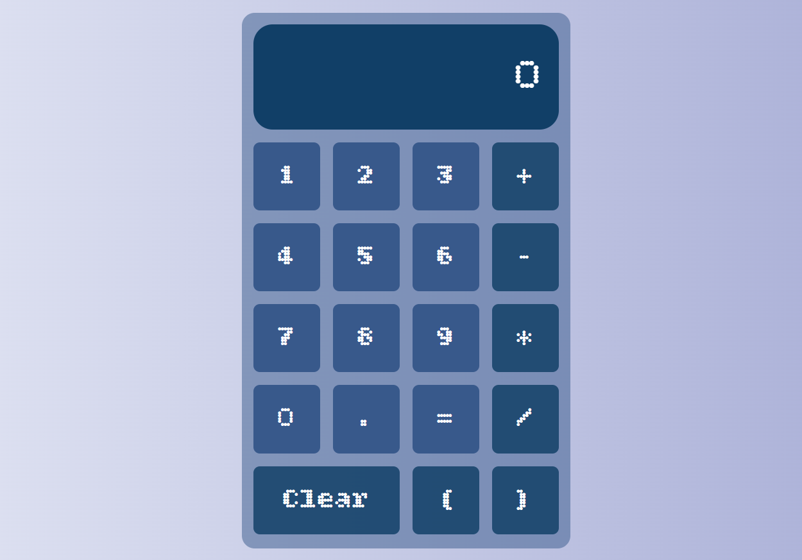

Simple Calculator

A responsive, interactive calculator built with HTML, CSS, and JavaScript.  
It evaluates full mathematical expressions, including brackets and decimals, and provides real-time input feedback.

## Live demo
[👉 Click here to play the live version!](https://varosya.github.io/calculator/)

## 🚀 Features

- ✅ Basic math operations: `+`, `-`, `*`, `/`
- ✅ Decimal support (e.g. `12.5 * 0.8`)
- ✅ Bracket support `( )`
- ✅ Input sanitization for safe evaluation
- ✅ `Clear` button to reset screen
- ✅ Expression result shown after pressing `=`
- ✅ Screen resets automatically after result or error
- ✅ Typewriter-style input area (`|` blinking bar)

---

## 🎮 How It Works

- Press any button to build your expression.
- Click `=` to evaluate.
- Use `Clear` to reset everything.
- If result is invalid, you'll see `Error`.
- After result or error, next input will start fresh.

---

## 💻 Technologies Used

- **HTML** – calculator layout
- **CSS** – custom styling and display
- **JavaScript** – logic, display, and evaluation

Here’s what it looks like:

